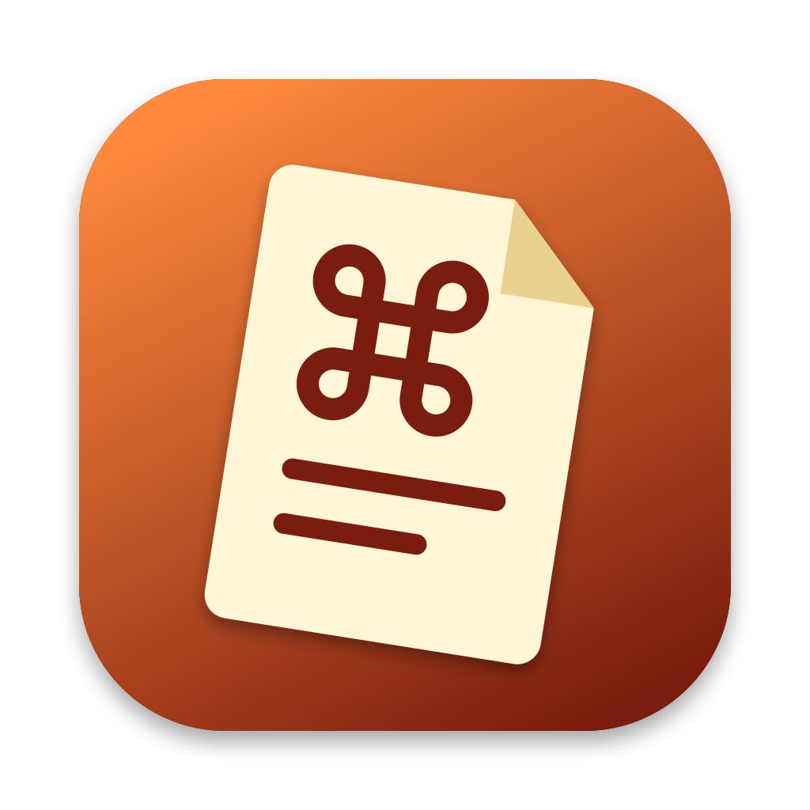

# AeroCheat



macOS menu bar cheatsheet for [AeroSpace](https://github.com/nikitabobko/AeroSpace) shortcuts, with an active mode that suggests the keyboard shortcut when you switch workspace or window with the mouse.

This is a proof of concept: the menu bar app, the cheatsheet panel, and an active mode limited to mouse-driven workspace switches and window changes. The active mode has been unit-tested with synthetic and replayed event streams, but not yet verified by hand against a live AeroSpace.

## What it does

- Lives in the menu bar (no Dock icon). The menu offers **Show Cheatsheet**, **Reload AeroSpace Config**, the active mode controls (below), **Settings…** and **Quit AeroCheat**.
- A global hotkey toggles a floating cheatsheet panel above other windows. **Esc** or pressing the hotkey again closes it.
- The panel lists the bindings of your AeroSpace config, grouped by mode (`[mode.<name>.binding]`), with modifiers shown as ⌃ ctrl, ⌥ alt, ⇧ shift, ⌘ cmd. A search field filters by key, modifier name, or command.
- The config is read at launch (and on **Reload AeroSpace Config**) from `~/.aerospace.toml`, falling back to `~/.config/aerospace/aerospace.toml`, unless you [point the app at another file](#using-a-non-default-aerospace-config). Symlinks are followed. The file is only ever read, never written.
- A missing or unparsable config shows a clear message in the panel instead of a list.

### Default hotkey

**⌃⌥⌘C** (ctrl + option + cmd + C). Three modifiers keep it clear of the usual AeroSpace bindings (`alt-…`, `alt-shift-…`, `ctrl-alt-…`). It is defined in one place: [`Sources/AeroCheat/HotkeyConfig.swift`](Sources/AeroCheat/HotkeyConfig.swift). If another app already owns the combo, the registration fails, a line is logged, and the menu bar item still works.

## Active mode

While active mode is on, AeroCheat notices when you switch workspace **with the mouse** (clicking a SketchyBar workspace item, a Dock icon whose app lives on another workspace, or a window of another workspace in Mission Control) and shows a small bubble, by default at the top right of the screen below the menu bar and SketchyBar (clear of the window close and minimise buttons; [Settings](#settings) moves it), with the shortcut you could have used, for example "⌃⌥ 3 — switch to workspace 3". Modifier keys (control, option, shift, command) are drawn as their SF Symbol icons, other keys as keycap text. The shortcut comes from your own `[mode.main.binding]` table; if the config has no binding for that workspace, nothing is shown. For now every mouse-driven switch triggers a suggestion, including ones caused by a notification click or a click that opens an app on another workspace.

It also notices when a click moves focus to **another window of the same workspace** (typically a window in Mission Control, or in a Dock window list, reaching a window hidden behind others) and suggests the focus shortcuts along the layout of that workspace: `focus left` with "or ⌃⌥ L to focus right" for a horizontal layout, `focus up` and `focus down` for a vertical one. The pair is taken from your config (whichever of the two you bound; the first binding in file order when several do the same). The bubble stays silent when the config has no matching `focus` binding, for floating windows, for macOS native-fullscreen windows and Spaces, and for a click on the window that is already focused. A plain click on a visible tiled window is also silent: the pointer lands inside the window it focuses. In accordion layouts windows overlap, so a click that changes window there is always taken as indirect.

Switching with the keyboard (your AeroSpace bindings), with Cmd-Tab (a key pressed after the click rules the click out), or through Spotlight or a script never triggers a suggestion. A click on a window of another workspace and a click on another window of the same workspace share the cooldown, the rate limit and the muting below; the cooldown applies per binding (for a focus pair, to the first one), and pressing either binding of the pair mutes it.

### How to try it

1. Make sure AeroSpace 0.21.0-Beta or newer is running (`aerospace --version`).
2. `swift run AeroCheat`, then open the menu bar item and tick **Active Mode**. It is off by default; the choice is saved in `UserDefaults`.
3. Click a workspace item in your bar, a Dock icon of an app on another workspace, or (three-finger swipe up) a window of another workspace in Mission Control; in an accordion workspace, click another window of it in Mission Control. The bubble appears within a fraction of a second and stays for 4 seconds (by default), then fades.
4. Press the suggested shortcut instead: no bubble, and that shortcut is muted for the rest of the day.

The menu shows the connection state (for example "AeroSpace not found", "AeroSpace 0.20.x is too old" or "AeroSpace is not running, retrying…"), a **Last suggestion** line and **Snooze Suggestions for 1 Hour**. The connection is re-established with a growing delay if AeroSpace exits or restarts.

To keep it quiet (these are the defaults, see [Settings](#settings)): the same suggestion repeats at most every 30 s, at most one bubble appears every 5 s, a shortcut you press after a suggestion is muted for the day, and a suggestion ignored three times is muted for the day too.

### How it works, and why it needs no permission

AeroCheat runs `aerospace subscribe --no-send-initial focus-changed focused-workspace-changed binding-triggered mode-changed` as a child process (found in `/opt/homebrew/bin`, `/usr/local/bin`, then `PATH`) and reads its JSON events. AeroSpace emits `binding-triggered` whenever a keyboard binding fires, so a workspace change that arrives without one did not come from your AeroSpace shortcuts. Events less than about 120 ms apart form a burst; a burst with a binding is keyboard and ignored, a burst with a net workspace change and no binding is a candidate, and so is a burst of `focus-changed` events alone that moves focus to another window of the same workspace. A candidate becomes a mouse action only if the left mouse button went down or up within the last 0.8 s and no key or modifier came after that click, both read with `CGEventSource.secondsSinceLastEventType`. For a same-workspace candidate AeroCheat also runs the read-only `aerospace list-windows --all --format '%{window-id} %{window-layout}'` once to read the layout of the window that took focus, and for a tiled one compares the pointer position (`CGEvent(source: nil)`) with the window's bounds from the window server.

None of this needs Accessibility, Input Monitoring or Screen Recording: the event stream is a user-level socket behind the `aerospace` CLI, and the click recency counters are not privacy-gated. AeroCheat does not use an event tap or a global `NSEvent` monitor, and it does not post system notifications. It only runs read-only `aerospace` commands (`--version`, `subscribe`, `list-windows`) and changes nothing in your AeroSpace or SketchyBar configuration.

Out of scope for now: suggestions for a direct click on a visible window, telling a Mission Control click from a Dock click or from a click that opens an app (so the wording never mentions Mission Control), choosing a single focus direction, drag and resize hints, Cmd-Tab suggestions, binding modes other than `main`, and multiple monitors.

Known limits of the same-workspace case: a click on a Dock icon or a menu item that opens or raises a window of the same workspace is indistinguishable from a window click and shows the focus suggestion; in a tiled layout a Mission Control thumbnail can sit over the window's real frame, which reads as a direct click and stays silent; in an accordion layout a click that closes a window or opens one can look like an indirect click. Closing a window (focus falls to a neighbour) and opening a window from an empty workspace stay silent.

## Using a non-default AeroSpace config

If your AeroSpace config is not at `~/.aerospace.toml` or `~/.config/aerospace/aerospace.toml`, open **Settings…** and use the **AeroSpace config** section at the top:

- type the path in the field and press Return, or click **Choose…** and pick the file (any file can be picked; AeroSpace's is usually `aerospace.toml`; hidden files are shown);
- **Use default location** (or emptying the field) goes back to the automatic search above.

The change applies at once: the cheatsheet panel, the active mode's shortcut suggestions and **Reload AeroSpace Config** all use the new path, and the section shows the path in use and either the number of bindings found or the error. The path is saved in `UserDefaults` (`config.path`, nothing is stored while it is automatic).

A path may start with `~`, be relative (taken from your home folder) or go through a symlink. A custom path is never mixed with the automatic search: if the file is missing, is a folder, cannot be read, is not UTF-8 or is not valid TOML, you get that error in the settings and in the panel rather than the default config. Likewise a damaged saved value is reported, not silently replaced. The file is only read, never written. The app does not detect the path from AeroSpace and does not watch the file: use **Reload AeroSpace Config** after editing it. In `--demo` mode the sample config always stands in and the path is not saved.

## Settings

**Settings…** in the menu bar menu opens a window that configures the AeroSpace config path (above) and the bubble and when it appears. Every change applies at once, without restarting, and is saved in `UserDefaults` (one `display.*` entry per setting). The defaults are the behaviour described above, so nothing changes until you change something.

| Group | What you can set |
|-------|------------------|
| Position | Where the bubble sits, on a 3x3 grid like the screen: the four corners, the middle of each edge and the centre (default: top right). Horizontal and vertical margins (default 16 pt and 80 pt) keep it clear of the menu bar, SketchyBar and window buttons; the margin is measured from the edge the anchor is on and ignored along a centred axis. The bubble always stays inside the visible frame. |
| Look | Background, text and icon/key colours (each either the system look or a picked colour), overall opacity (30–100 %), size (75–175 %, scales fonts, icons and padding), how long it stays (1–30 s, default 4). |
| Delays | Minimum time between any two tips (0–600 s, default 5) and between two identical tips (0–3600 s, default 30). |
| Content | Modifier keys as icons or as text glyphs, and which kinds of suggestions are on (workspace switches, window focus). |

**Reset to defaults** restores everything. **Preview** shows the bubble with the current settings, using the demo script's sample suggestion and the real bubble view, so you can tune the position and colours without waiting for a mouse switch. Values outside their range are clamped, and a corrupt stored value falls back to its default.

Behind it: `DisplaySettings` (UI-free, in `AeroCheatCore`) holds the values, their ranges and the policy delays; `DisplaySettingsStorage` persists them; `BubbleStyle(settings:)` maps them to the bubble; `SettingsView` is the window. To add a kind of suggestion, add a case to `SuggestionKind` and a branch in `Suggestion.kind`: the window lists every case, so it needs no change. In demo mode the window edits your saved look in memory only, nothing is written.

Needs no permission. The window and the live look are verified by unit tests and offscreen renderings only; try the window by hand with `swift run AeroCheat --demo` and the **Preview** button.

## Demo mode and offscreen tests

Neither needs AeroSpace, a permission or a click, so the bubble can be checked without touching a live session.

### Demo mode

```sh
swift run AeroCheat --demo
```

Plays a short script of fixture events (about 35 s) instead of the real AeroSpace stream: a mouse switch (bubble), a keyboard switch (nothing), the same mouse switch repeated (rate limited, nothing), then two more mouse switches, the last one with the toggle-back hint. The events go through the same burst classifier, action resolver, suggestion policy and bubble as the real mode; only their source differs. Each step is logged with what you should see.

Demo mode never starts `aerospace subscribe`, never reads `~/.aerospace.toml` (a built-in sample config stands in, also for the cheatsheet) and never writes your preferences (it does read your saved display settings, so the bubble looks the way you configured it). Active Mode is on from the start; untick and tick it in the menu to replay.

The script is `DemoScript.scenarios` in [`Sources/AeroCheatCore/DemoScript.swift`](Sources/AeroCheatCore/DemoScript.swift), a list of scenarios (events, pause before it, expected outcome). `DemoScriptTests` replays it through the real pipeline with a simulated clock and fails if a scenario does not do what it says, so add a scenario to the list and the test covers it.

### Offscreen rendering tests

The bubble (`BubbleView`) and the value type that configures it (`BubbleStyle`: anchor, margins, duration, sizes, colours; `DisplaySettings()` maps to the shipped values, top right) live in the `AeroCheatUI` target. `Tests/AeroCheatUITests` renders the view into a bitmap with `NSHostingView` and `cacheDisplay`, with no screen, window server window or permission, and asserts what is deterministic:

- the hint line making the bubble taller, and the size setting scaling it;
- the origin computed for a fake screen frame (the nine anchors, the margins, a secondary screen), including that the top edge clears SketchyBar (about 74 pt from the screen top);
- the default 4 s duration and the other defaults, and that the settings map to the style (size, opacity, colours, icons versus text);
- modifier keys drawn as icons, with the glyph text as fallback when an SF Symbol is unavailable, and that the two renderings differ.

There is no golden-image comparison: pixels vary with the OS version, the appearance and the material blur. To look at the result, set `AEROCHEAT_SNAPSHOT_DIR` and the tests also write each rendering there as a PNG:

```sh
AEROCHEAT_SNAPSHOT_DIR=/tmp/aerocheat-bubbles swift test --filter AeroCheatUITests
```

## Build and run

Requires macOS 13+ and a Swift 5.9+ toolchain (Xcode or Command Line Tools).

```sh
swift build            # debug build
swift run AeroCheat    # launch; look for the crib-note logo in the menu bar
swift run AeroCheat --demo  # same, playing fixture events instead of AeroSpace's (see above)
swift test             # unit tests and offscreen bubble rendering tests
```

For a release binary: `swift build -c release`, then run `.build/release/AeroCheat`.

### Continuous integration

[`.github/workflows/ci.yml`](.github/workflows/ci.yml) runs `swift build` and `swift test` on a GitHub-hosted macOS runner for pull requests and pushes to `main`. It is gated to public repositories (a skipped job starts no runner and costs nothing), so it does nothing while this repository is private. Once the repository is public it runs on its own; to run it by hand, use the **Actions** tab (**CI** → **Run workflow**) or `gh workflow run ci.yml`.

## Permissions

None. The hotkey uses the Carbon `RegisterEventHotKey` API, which needs neither Accessibility nor Input Monitoring, and active mode is permission-free too (see above). The app does not touch the network and reads only your AeroSpace config.

## Layout

| Path | Role |
|------|------|
| `Sources/AeroCheatCore` | UI-free logic: minimal TOML reader, AeroSpace binding parser, key formatting, search filter; active mode event model, burst classifier, action resolver, window layout, suggestion policy; display settings and their storage; AeroSpace config path resolution and storage; demo script |
| `Sources/AeroCheatUI` | The menu bar logo (`MenuBarLogo`, glyph embedded by `MenuBarGlyphData`); the suggestion bubble: `BubbleStyle` (position, colours, sizes), `BubbleContent`, `BubbleView`; the live settings model, the live config source (`ConfigSourceModel`) and the settings window's `SettingsView` |
| `Sources/AeroCheat` | Menu bar app: status item, global hotkey, floating panel, SwiftUI view; active mode event sources (real stream, demo), mouse and key recency probe, focused window probe, toast panel, settings window |
| `Assets`, `scripts/render-logo.swift` | The app icon and menu bar glyph; run `swift scripts/render-logo.swift` to redraw them and regenerate the embedded glyph data |
| `Tests/AeroCheatCoreTests` | Unit tests, using `Fixtures/sample-aerospace.toml` and sanitised `golden-replay.jsonl` and `mission-control-replay.jsonl` replays rather than a real config or capture; the demo script replay |
| `Tests/AeroCheatUITests` | Offscreen rendering and geometry tests of the bubble |
